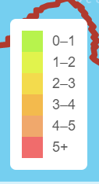
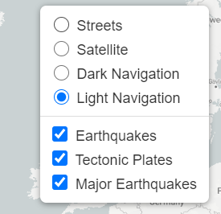
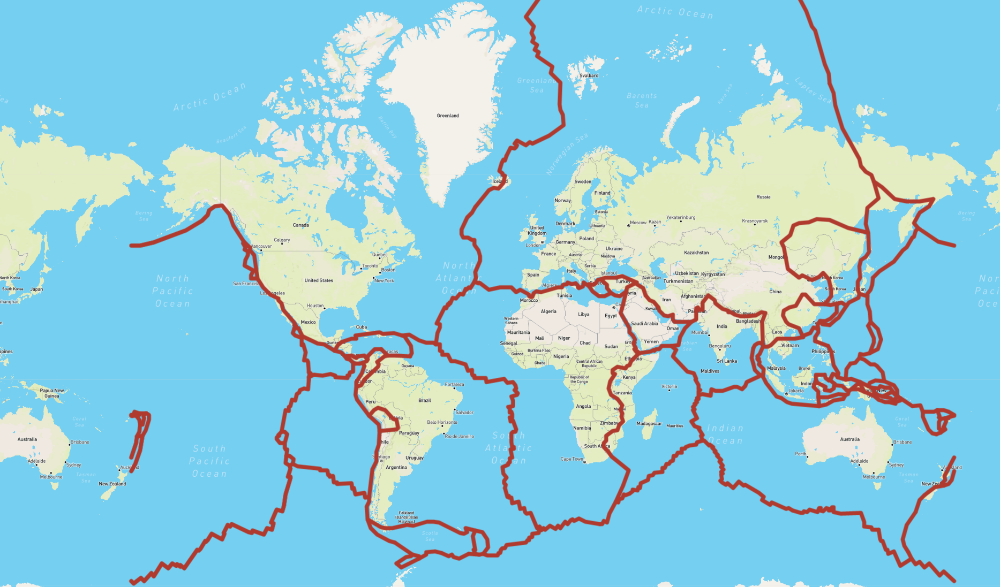
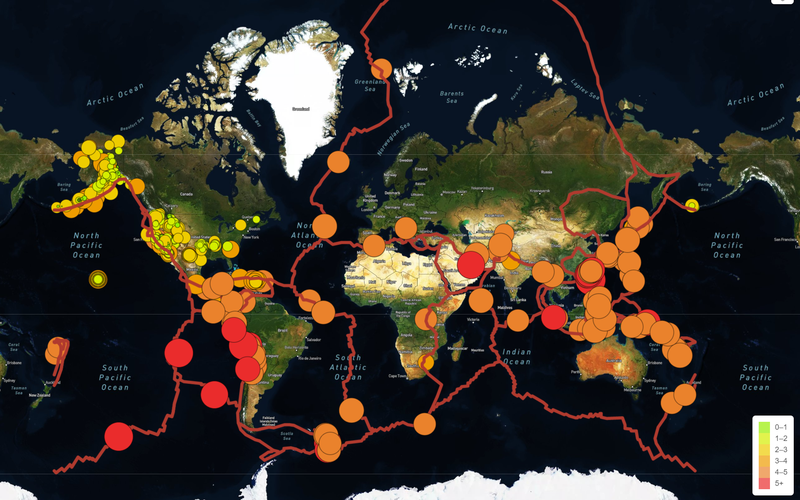
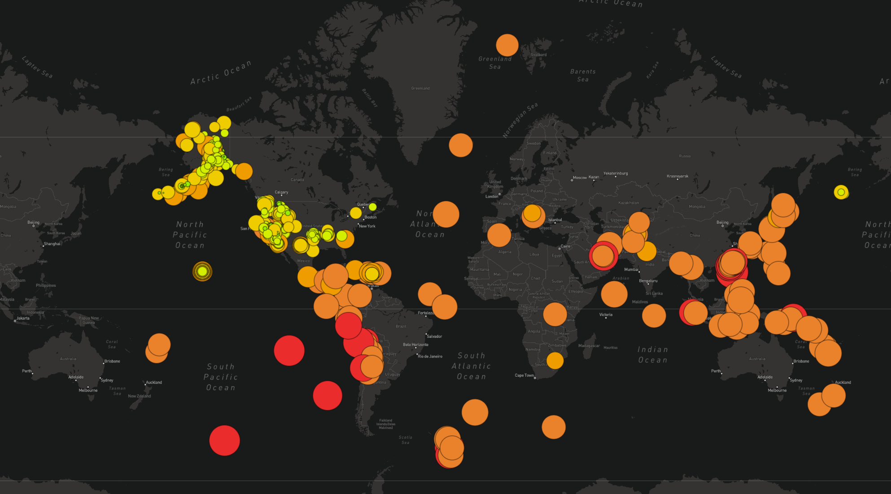

# Mapping_Earthquakes
Mapping earthquakes using Javascript

## Objective
* Create and merge multiple branches of various earthquake data using GeoJSON and API requests.
* Create a multi layered map using Leaflet.

## Results
### Magnetude Scale for reference in deciphering map

Scale is color coded based on magnetude scale of earthquake to provide insight into map colorcoding.

### Creating multiple layers

The above provides multiple viewing layers within one interactive screen.

Below are some examples of varying map options
* Street Layer + Tectonic Plates 

* Satellite Layer

* Dark Layer + all earthquakes

